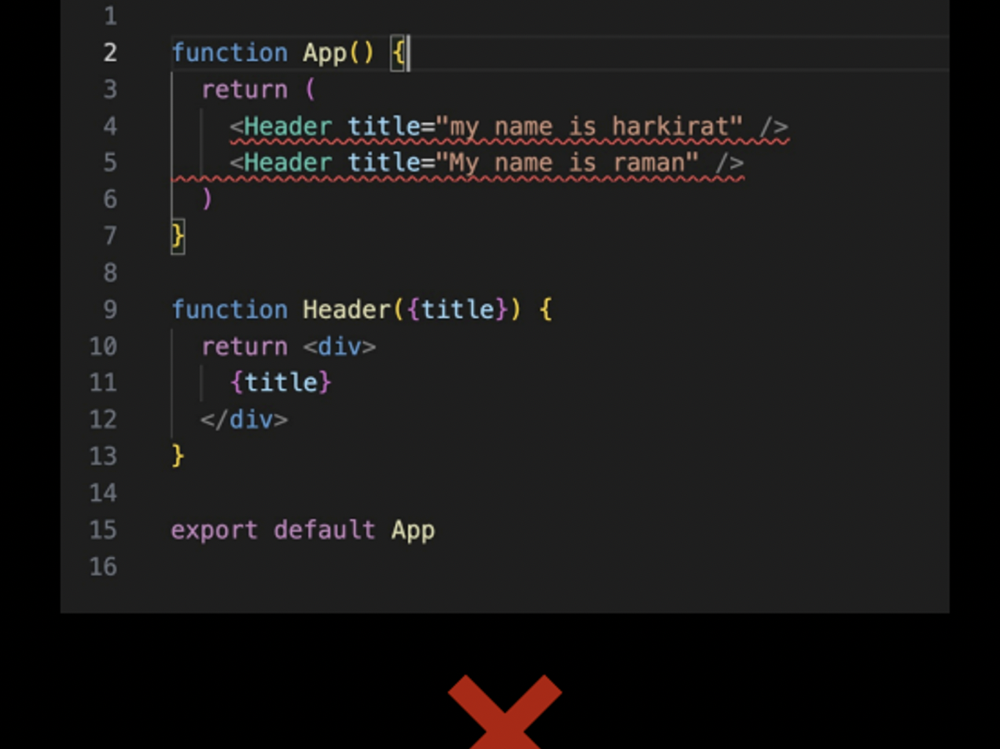
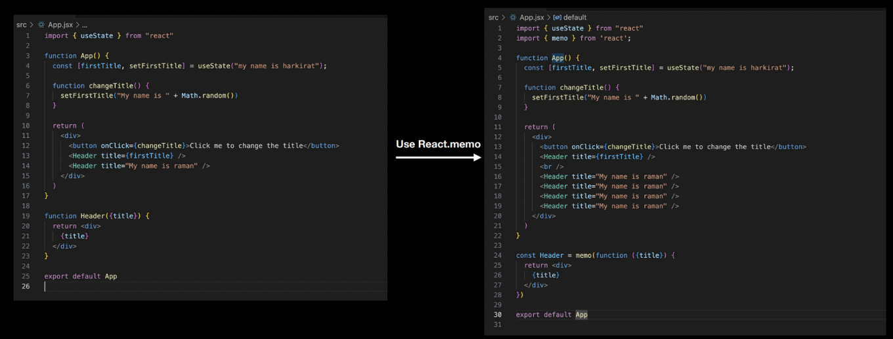

# React Hooks

Explored essential concepts in React development, emphasizing the significance of a single parent component for efficient reconciliation and rerendering. The discussion delved into strategies for minimizing rerenders, highlighting the use of memoization with **useMemo** and the importance of keys in array iteration. The lecture also introduced the concept of wrapper components, showcasing their role in maintaining consistent styling. Furthermore, Harkirat provided insights into the choice between class-based and functional components, concluding with a brief overview of the **useEffect** hook. These insights offer a solid foundation for understanding core React principles.

## React Returns

In React, a component can only return a single root element, commonly wrapped in a parent container (like a div). This rule exists because React needs a single entry point to render and manage the component's output.



One of the most prominent reasons for it is **Reconciliation**. The single-root element rule in React facilitates the reconciliation process, where React efficiently updates the real DOM based on changes in the virtual DOM. By having a single root element, React can easily perform the comparison between the previous and current states of the **virtualDOM**.

## Reconciliation

Reconciliation involves identifying what parts of the virtual DOM have changed and efficiently updating only those parts in the actual DOM. The single-root structure simplifies this process by providing a clear entry point for React to determine where updates should occur.

In addition to reconciliation, it aids in maintaining a straightforward and predictable structure in React components, making the code more readable and understandable. This constraint encourages developers to create components with well-defined boundaries, which enhances code organization and modularity.

While a single root element is required, React provides a feature called fragments (**<></> or <React.Fragment></React.Fragment>**) that allows you to group multiple elements without introducing an extra node in the real DOM. Fragments don't create an additional parent in the DOM but still satisfy the single-root rule.


## Object Destructuring

Object destructuring is a feature in JavaScript that allows you to extract values from objects and assign them to variables in a more concise and convenient way. This can make your code cleaner and more readable. Here's a brief explanation with an example:

### Basic Object Destructuring:

**Default Values**:
You can also provide default values in case the property is not
present in the object.

**Variable Assignment**:
You can use a different variable name during destructuring.

**Nested Object Destructuring**:
Destructuring also works with nested objects.

Object destructuring provides a concise and expressive way to extract values from objects, making your code more readable and maintainable.

## Re-rendering in React

Rerendering in React refers to the process of updating and rendering components to reflect changes in the application's state or props. When there's a change in the state or props of a component, React re-renders that component and any affected child components. It's important to note that a rerender doesn't necessarily mean a complete re-rendering of the entire DOM; instead, React efficiently updates only the necessary parts of the DOM.

**When Does a Rerender Happen?**

- Changes in a state variable utilized within the component.
- A re-render of a parent component, which subsequently triggers the re-rendering of all its child components. This cascading effect ensures synchronization throughout the component tree.

**Problem Statement**

- As it is known, we use React to create dynamic websites, which is often achieved through the use of components that can respond to user interactions, state changes, or incoming props.
- A crucial principle guiding efficient React applications is the minimization of unnecessary rerenders. Rerenders occur when there are alterations in a component's state or props, and the rule of thumb is to keep these rerenders to a minimum for optimal performance.
- Consider a scenario with a webpage featuring a counter button, a text element reflecting the change in the count state and a static "Hello, World!" text. While clicking the counter button might trigger a rerender of the text element containing the count due to state changes, it's essential to prevent the unnecessary rerendering of static elements.

## Solutions

There are broadly 2 ways of minimizing the amount of rerenders

- Push the State down
- By Using Memoization

### Pushing the State Down:

**Pushing the state down** in React refers to the practice of managing state at the lowest possible level in the component tree. By doing so, you localize the state to the components that absolutely need it, reducing unnecessary re-renders in higher-level components.

When state is kept at a higher level in the component tree, any changes to that state can trigger re-renders for all child components, even if they don't directly use or depend on that particular piece of state. However, by **pushing the state down** and ensuring that each component only has access to the state it needs, you can minimize the impact of state changes on the overall component tree.

./img/4.png)

For example, if a specific piece of state is only relevant to a small portion of your application, keeping that state localized to the components in that section prevents unnecessary re-renders elsewhere. This practice contributes to a more efficient and performant React application.

### By Using Memoization:

The above problem of reducing the number of rerenders can also be tackled using Memoization. Memoization in React, achieved through the useMemo hook, is a technique used to optimize performance by memoizing (caching) the results of expensive calculations. This is particularly useful when dealing with computations that don't need to be recalculated on every render, preventing unnecessary recalculations and re-renders.

In the context of minimizing re-renders, useMemo is often employed to memoize the results of computations derived from state or props. By doing so, you can ensure that the expensive computation is only performed when the dependencies (specified as the second argument to useMemo) change.



By using **seMemo**, you can strategically memoize computations to optimize performance and minimize the impact of re-renders in React.

## Significance of Key in React

In React, when rendering a list of elements using the map function, it is crucial to assign a unique key prop to each element. The "key" is a special attribute that helps React identify which items have changed, been added, or been removed. This is essential for efficient updates and preventing unnecessary re-renders of the entire list.

When the key prop is not provided or not unique within the list, React can't efficiently track the changes, leading to potential issues in the application's performance and rendering.

Here's a simple example illustrating the importance of keys in a todo app:

```
import React, { useState } from 'react';

function TodoApp() {
    const [todos, setTodos] = useState([]);
    const [inputValue, setInputValue] = useState('');

    const handleInputChange = (e) => {
        setInputValue(e.target.value);
    };

    const handleAddTodo = () => {
        if (inputValue.trim() !== '') {
            const newTodo = {
                id: todos.length + 1,
                text: inputValue.trim(),
            };
            setTodos([...todos, newTodo]);
            setInputValue('');
        }
    };

    const handleRemoveTodo = (id) => {
        setTodos(todos.filter(todo => todo.id !== id));
    };

    return (
        <div>
            <h2>Todo List</h2>
            <input
                type="text"
                value={inputValue}
                onChange={handleInputChange}
                placeholder="Enter todo"
            />
            <button onClick={handleAddTodo}>Add Todo</button>
            <ul>
                {todos.map(todo => (
                    <li key={todo.id}>
                        {todo.text}
                        <button onClick={() => handleRemoveTodo(todo.id)}>Remove</button>
                    </li>
                ))}
            </ul>
        </div>
    );
}

export default TodoApp;
```

In this example, each todo item in the list has a unique **id** that serves as the **key** prop. When a new todo is added, the **key** helps React efficiently update and re-render only the necessary parts of the list, maintaining performance and ensuring a smooth user experience.

## Wrapper Components

In React, wrapper components are used to encapsulate and group common styling or thematic elements that need to be applied consistently across different parts of an application. These components act as containers for specific sections or functionalities, allowing for a clean and modular structure.

Let's consider an example where we have a wrapper component called Card that provides a consistent styling for various content sections, such as blog posts. The Card component maintains the overall styling, while different contents can be dynamically injected.

Now, we can use this CardWrapper component to create specific cards for different content, such as blog posts, by providing the dynamic content as children.

```

function App() {

  return (
    <div style={{display: "flex"}}>
      <Card>
        hi there
      </Card>
      <Card>
        <div>
          hello from the 2nd card
        </div>
      </Card>
    </div>
  )
}

function Card({children}) {
  return <div style={{
    border: "1px solid black",
    padding: 10,
    margin: 10
  }}>
    {children}
  </div>
}

export default App
```

With this structure, we maintain a consistent card styling across different sections of our application, promoting reusability and making it easy to manage the overall theme. This approach is especially beneficial when you want to keep a uniform appearance for similar components while varying their internal content.

## Class Components vs Functional Components

In React, components are the building blocks of a user interface. There are two main types of components: class-based components and functional components.

1. **Class-Based Components:**

- Class-based components are ES6 classes that extend from React.Component.
- They have access to the lifecycle methods provided by React, such as componentDidMount, componentDidUpdate, and componentWillUnmount.
- State and lifecycle methods are managed within class-based components.
- They were the primary type of components before the introduction of hooks in React 16.8.
  Example of a class-based component:

2. **Functional Components:**

- Functional components are simpler and more concise. They are essentially JavaScript functions that take props as an argument and return React elements.
- With the introduction of React hooks in version 16.8, functional components gained the ability to manage state and use lifecycle methods through hooks like useState and useEffect.
- They are generally easier to read and write.

**Note:**

- Functional components are now the preferred way to write components in React due to their simplicity and the additional capabilities provided by hooks.
- Hooks like useState and useEffect allow functional components to manage state and perform side effects, making them as powerful as class-based components.
- Class-based components are still used in some codebases, especially in projects that haven't migrated to functional components or are working with older React versions.

## React Hooks

React Hooks are functions that allow functional components in React to have state and lifecycle features that were previously available only in class components. Hooks were introduced in React 16.8 to enable developers to use state and other React features without writing a class.

Using these hooks, developers can manage state, handle side effects, optimize performance, and create more reusable and readable functional components in React applications. Each hook serves a specific purpose, contributing to a more modular and maintainable codebase.

Some commonly used React Hooks are: **useEffect, useMemo, useCallback, useRef, useReducer, useContext, useLayoutEffect**

**useEffect()**  
useEffect is a React Hook used for performing side effects in functional components. It is often used for tasks such as data fetching, subscriptions, or manually changing the DOM. The useEffect hook accepts two arguments: a function that contains the code to execute, and an optional array of dependencies that determines when the effect should run.


Here's an example of how to use useEffect:
In this example:

- We import useState and useEffect from 'react'.
- Inside the DataFetcher component, we use useState to manage the state of the data variable.
- The useEffect hook is employed to perform the data fetching operation when the component is mounted. The empty dependency array [] ensures that the effect runs only once after the initial render.
- The fetchData function, declared inside the effect, simulates an asynchronous data fetching operation. Upon success, it updates the data state.
- The component returns content based on whether the data has been fetched.

**useEffect** is a powerful tool for managing side effects in React components, providing a clean way to handle asynchronous operations and component lifecycle events.
