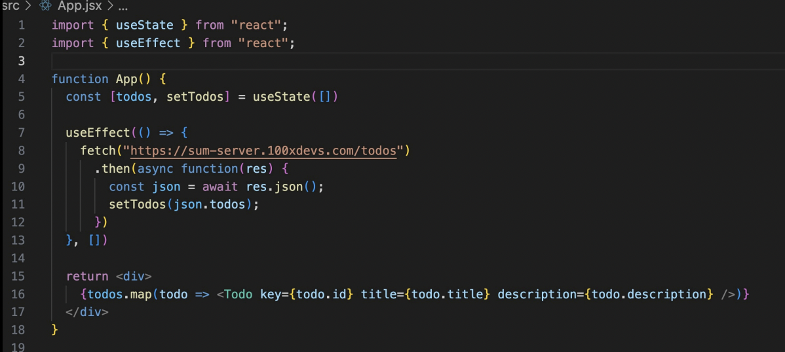
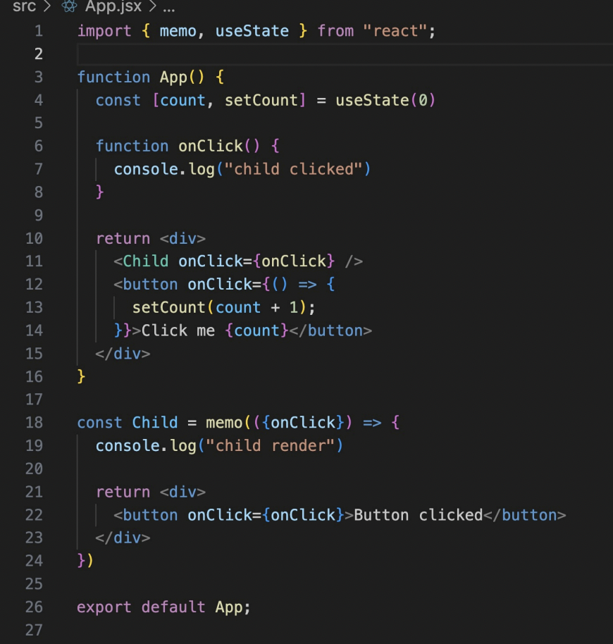
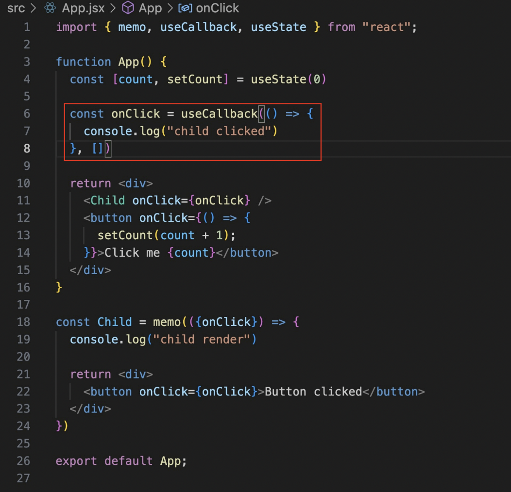

# useEffect, useMemo, useCallback

In this lecture, starting with React Hooks like useEffect, useMemo, useCallback, and more, providing practical insights into state management and component functionalities. The discussions extend to creating custom hooks for reusable logic. Prop drilling, a common challenge in passing data between components, is addressed, offering effective solutions. The lecture also covers the Context API, a powerful tool for simplified state management across an entire React application.

## Side Effects in React

In the context of React, **side effects** refer to operations or behaviors that occur outside the scope of the typical component rendering process. These can include data fetching, subscriptions, manual DOM manipulations, and other actions that have an impact beyond rendering the user interface.  
Thus, "side effects" are the operations outside the usual rendering process, and "hooks," like useEffect, are mechanisms provided by React to handle these side effects in functional components. The useEffect hook allows you to incorporate side effects into your components in a clean and organized manner.

## React Hooks

React Hooks are functions that allow functional components in React to have state and lifecycle features that were previously available only in class components. Hooks were introduced in React 16.8 to enable developers to use state and other React features without writing a class.

Using these hooks, developers can manage state, handle side effects, optimize performance, and create more reusable and readable functional components in React applications. Each hook serves a specific purpose, contributing to a more modular and maintainable codebase.

Some commonly used React Hooks are:

1. **useState()**
   **useState** is a React Hook that enables functional components to manage state. It returns an array with two elements: the current state value and a function to update that value.

Here's an example of how to use useState:  

In this example:

- We import the useState function from the 'react' package.
- Inside the Counter component, we use useState(0) to initialize the state variable count with an initial value of 0.
- The count state and the setCount function are destructured from the array returned by useState.
- The increment function updates the count state by calling setCount(count + 1) when the button is clicked.
- The current value of the count state is displayed within a paragraph element.

2. **useEffect()**
   **useEffect** is a React Hook used for performing side effects in functional components. It is often used for tasks such as data fetching, subscriptions, or manually changing the DOM. The useEffect hook accepts two arguments: a function that contains the code to execute, and an optional array of dependencies that determines when the effect should run.

Here's an example of how to use useEffect:

In this example:

- We import useState and useEffect from 'react'.
- Inside the DataFetcher component, we use useState to manage the state of the data variable.
- The useEffect hook is employed to perform the data fetching operation when the component is mounted. The empty dependency array [] ensures that the effect runs only once after the initial render.
- The fetchData function, declared inside the effect, simulates an asynchronous data fetching operation. Upon success, it updates the data state.
- The component returns content based on whether the data has been fetched.

3. **useMemo()**
   **useMemo** is a React Hook that is used to memoize the result of a computation, preventing unnecessary recalculations when the component re-renders. It takes a function (referred to as the "memoized function") and an array of dependencies. The memoized function will only be recomputed when the values in the dependencies array change.

Here's an example of how to use useMemo:

In this example:

- We import useState and useMemo from 'react'.
- The ExpensiveCalculation component takes a prop value and uses useMemo to calculate an "expensive" result based on that value.
- The dependency array [value] indicates that the memoized function should be recomputed whenever the value prop changes.
- The MemoExample component renders an input element and the ExpensiveCalculation component. The value prop of ExpensiveCalculation is set to the current state of inputValue.
- As you type in the input, you'll notice that the expensive result is only recalculated when the input value changes, thanks to useMemo.

4. **useCallback()**
   **useCallback** is a React Hook that is used to memoize a callback function, preventing unnecessary re-creation of the callback on each render. This can be useful when passing callbacks to child components to ensure they don't trigger unnecessary renders.

Here's an example of how to use useCallback:

In this example:

- We import useState and useCallback from 'react'.
- The ChildComponent receives a prop onClick and renders a button with that click handler.
- The CallbackExample component maintains a count state and has two callback functions: handleClick and memoizedHandleClick.
- handleClick is a regular callback function that increments the count and logs a message.
- memoizedHandleClick is created using useCallback, and its dependency array ([]) indicates that it should only be re-created if the component mounts or unmounts.
- The ChildComponent receives the memoized callback (memoizedHandleClick) as a prop.
- As you click the button in the ChildComponent, the count increases, and you'll notice that the log statement inside handleClick is only printed once, thanks to useCallback preventing unnecessary re-creations of the callback.

## Difference between useEffect, useMemo & useCallback

1. **useEffect:**
   Purpose: Manages side effects in function components.
   Triggers: Runs after rendering and on subsequent re-renders.
   Use Cases: Fetching data, subscriptions, manually changing the DOM, etc.

2. **useMemo:**
   Purpose: Memoizes the result of a computation to avoid unnecessary recalculations.
   Triggers: Runs during rendering.
   Use Cases: Memoizing expensive calculations, preventing unnecessary re-renders.

3. **useCallback:**
   Purpose: Memoizes a callback function to prevent unnecessary re-renders of child components.
   Triggers: Runs during rendering.
   Use Cases: Preventing unnecessary re-renders when passing callbacks to child components.

In summary, useEffect is for handling side effects, useMemo is for memoizing values, and useCallback is for memoizing callback functions. Each serves a different purpose in optimizing and managing the behavior of React components.
